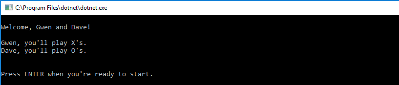
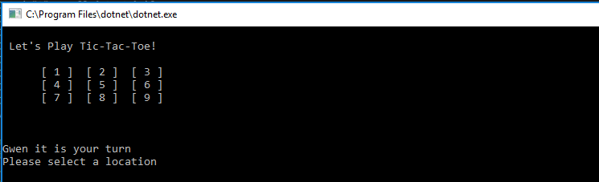
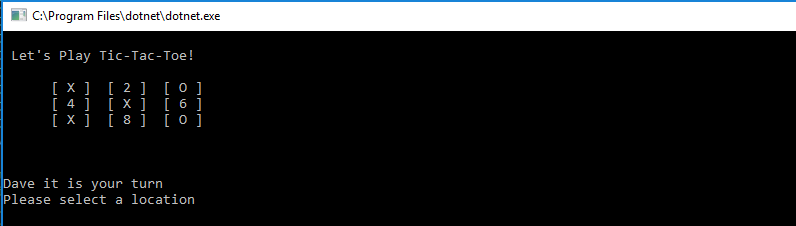
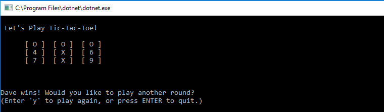
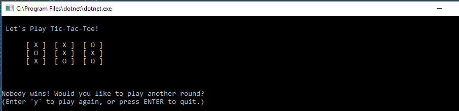

# Lab04-TicTacToe
CF 401 Lab 4 - Tic-Tac-Toe (Classes and Objects)

## Introduction to Tic-Tac-Toe Game
This application is a 2-player tic-tac-toe game. Players enter their names, play a single game, and choose whether to play more rounds.

## Visuals
These sample session images show:
 - Game setup - player name inputs
 
  - Game setup - both players ready, start game prompt
 
  - Game start
 
  - Game in session
   
 - Game resulted in a win
  
 - Tied game
  

## How to use
The application automatically launches and prompts the players to enter their names (almost any name entered is accepted, but blanks are rejected and exceptions are thrown). Players are assigned and informed of their markers ('X' or 'O') and prompted to enter game when ready.
The game board displays, and Player 1 is prompted to enter a location to play. If valid (ie - number 1-9, not already occupied), the chosen location is updated to reflect the player's marker. Player 2 is prompted to play in the same manner. Play continues until the match is won (ie - the play board matches one of the 'win' cases) or the match is deemed a draw (ie - the board doesn't match a 'win' case, and the play counter hits 9 plays). The game results are displayed, and the players are prompted to play again or exit.

## Other details
Unit tests confirm that:
  - win cases are correctly confirmed
  - no-win cases are correctly confirmed
  - player switches happen correctly when called
  - player's selection is translated to correct play board coordinates
